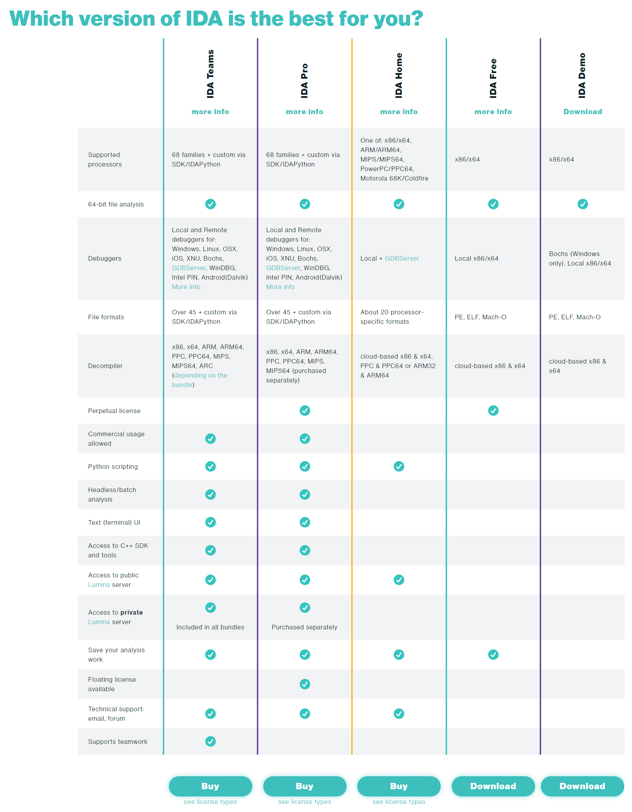

# [IDA](https://hex-rays.com/) 强大的逆向工具

## Which version of IDA is the best for you?

IDA 通用教程

- [分析受保护和经过模糊处理的 PE 可执行文件](https://hex-rays.com/products/ida/support/tutorials/unpack_pe/)
- [绘图教程](https://hex-rays.com/products/ida/support/tutorials/graphs)
- [完全可定制的工作环境](https://hex-rays.com/products/ida/support/tutorials/customize)
- [定义结构](https://hex-rays.com/products/ida/support/tutorials/structs)
- [数据类型、操作数和高级构造（联合、结构、可变大小结构）](https://hex-rays.com/products/ida/support/tutorials/datastruct)
- [位字段教程](https://hex-rays.com/products/ida/support/tutorials/bitfields/)
- [我们的工会教程](https://hex-rays.com/products/ida/support/tutorials/unions/)
- [可变长度结构教程](https://hex-rays.com/products/ida/support/tutorials/varstr/)
- [枚举类型教程](https://hex-rays.com/products/ida/support/tutorials/enum/)
- [使用 IDA Pro 调试 XNU 内核](https://hex-rays.com/wp-content/uploads/2019/12/xnu_debugger_primer.pdf)
- [基于 CSS 的样式](https://hex-rays.com/products/ida/support/tutorials/themes)
- IDAClang 教程[.pdf](https://hex-rays.com/tutorials/idaclang/idaclang_tutorial.pdf) - [.html](https://hex-rays.com/tutorials/idaclang/idaclang_tutorial.html)

IDC 教程

- [添加自定义注释。](https://hex-rays.com/products/ida/support/tutorials/idc/autocomment)
- [使用脚本驱动 IDA，用于批处理操作。](https://hex-rays.com/products/ida/support/tutorials/idc/batch)
- [在分析时解密程序的某些部分。](https://hex-rays.com/products/ida/support/tutorials/idc/decrypt)
- [在驱动程序加载时挂接脚本。](https://hex-rays.com/products/ida/support/tutorials/idc/driver)
- [分析自定义资源。](https://hex-rays.com/products/ida/support/tutorials/idc/new_file_format)
- [C 样结构操作。](https://hex-rays.com/products/ida/support/tutorials/idc/struct_manip)
- [在 VxD 加载时挂接脚本。](https://hex-rays.com/products/ida/support/tutorials/idc/vxd)

调试器教程

- [在窗口下使用 IDA 的调试器。](https://hex-rays.com/wp-content/uploads/2019/12/debugging_win32.pdf)
- [在 Windows 计算机上调试。](https://hex-rays.com/products/ida/debugger/cross-win-linux/win32local)
- [在 Linux 计算机上调试。](https://hex-rays.com/products/ida/debugger/cross-win-linux/linuxlocal)
- [从 Windows 计算机调试 Linux 可执行文件。](https://hex-rays.com/products/ida/debugger/cross-win-linux/win32tolinux)
- [从 Linux 计算机调试 Windows 可执行文件。](https://hex-rays.com/products/ida/debugger/cross-win-linux/linuxtowin32)
- [从*另一*台 Windows 32 位计算机调试 Windows 32 位可执行文件。](https://hex-rays.com/products/ida/debugger/cross-win-linux/win32towin32)
- [从 Windows 64 位计算机调试 Windows 32 位可执行文件。](https://hex-rays.com/products/ida/debugger/cross-win-linux/win32towin64)
- [从 Linux 计算机调试 Windows 64 位可执行文件。](https://hex-rays.com/products/ida/debugger/cross-win-linux/linuxtowin64)
- [从*另一*台 Linux 计算机调试 Linux 可执行文件。](https://hex-rays.com/products/ida/debugger/cross-win-linux/linuxtolinux)
- [在 Mac OS X 下使用 IDA 的调试器](https://hex-rays.com/wp-content/uploads/2020/05/mac_debugger_primer2.pdf).同时获取相关的 [zip 文件。](https://hex-rays.com/wp-content/uploads/2020/05/samples.zip)
- [XNU 调试器教程。](https://hex-rays.com/wp-content/uploads/2019/12/xnu_debugger_primer.pdf)
- [使用 Bochs 调试器插件调试 Windows 应用程序。](https://hex-rays.com/wp-content/uploads/2019/12/debugging_bochs.pdf)
- [在Unix下使用Bochs调试器插件调试Windows应用程序。](https://hex-rays.com/wp-content/uploads/2019/12/debugging_bochs_linux.pdf)
- [将 IDA 的 GDB 服务器插件与 QEMU 结合使用。](https://hex-rays.com/wp-content/uploads/2019/12/debugging_gdb_qemu.pdf)
- [将 IDA 的 GDB Server 插件与 VMWare 配合使用：调试 Linux 内核。](https://hex-rays.com/wp-content/uploads/2019/12/debugging_gdb_linux_vmware.pdf)
- [将 IDA 的 GDB Server 插件与 VMWare 配合使用：调试 Windows 内核。](https://hex-rays.com/wp-content/uploads/2019/12/debugging_gdb_windows_vmware.pdf)
- [使用 IDA 的 WinDBG 插件调试 Windows 应用程序。](https://hex-rays.com/wp-content/uploads/2019/12/debugging_windbg.pdf)
- [Windows 调试从 IDA 4.3 开始可用。](https://hex-rays.com/products/ida/debugger/windows)
- [Linux 调试从 IDA 4.7 开始可用。](https://hex-rays.com/products/ida/debugger/linux)
- [调试 Dalvik 应用程序。](https://hex-rays.com/wp-content/uploads/2019/12/debugging_dalvik.pdf)
- [调试 iOS/iPhone 应用程序。](https://hex-rays.com/wp-content/static/tutorials/ios_debugger_primer2/ios_debugger_primer2.pdf)

- [IDA 调试器跟踪](https://hex-rays.com/wp-content/uploads/2019/12/tracing.pdf)
- [WinDbg 调试器](https://hex-rays.com/wp-content/uploads/2019/12/debugging_windbg.pdf)
- [IDA+QEMU 调试器](https://hex-rays.com/wp-content/uploads/2019/12/debugging_gdb_qemu.pdf)
- [IDA+VMWare/Linux Debugger](https://hex-rays.com/wp-content/uploads/2019/12/debugging_gdb_linux_vmware.pdf)
- [IDA+VMWare/Windows/Kernel Debugger](https://hex-rays.com/wp-content/uploads/2019/12/debugging_gdb_windows_vmware.pdf)
- [IDA 5.6 应用呼叫用户指南](https://hex-rays.com/wp-content/uploads/2019/12/debugging_appcall.pdf)
- [博克斯调试器](https://hex-rays.com/wp-content/uploads/2019/12/debugging_bochs.pdf)
- [Unix 下的 Bochs Debugger](https://hex-rays.com/wp-content/uploads/2019/12/debugging_bochs_linux.pdf)
- [使用 QEMU 调试器调试代码片段（一个 IDA Bochs 调试器）](https://hex-rays.com/wp-content/uploads/2019/12/debugging_qemu.pdf)
- [远程调试](https://hex-rays.com/products/ida/support/freefiles/remotedbg.pdf)
- [跟踪重播和管理跟踪](https://hex-rays.com/wp-content/uploads/2019/12/trace_replayer.pdf)
- 使用 PIN 码[.pdf](https://hex-rays.com/products/ida/support/tutorials/pin/pin_tutorial.pdf) - [.html](https://hex-rays.com/products/ida/support/tutorials/pin/pin_tutorial.html)
- [达尔维克调试器](https://hex-rays.com/wp-content/uploads/2019/12/debugging_dalvik.pdf)
- [iOS 调试器](https://hex-rays.com/wp-content/uploads/2019/12/ios_debugger_tutorial.pdf)
