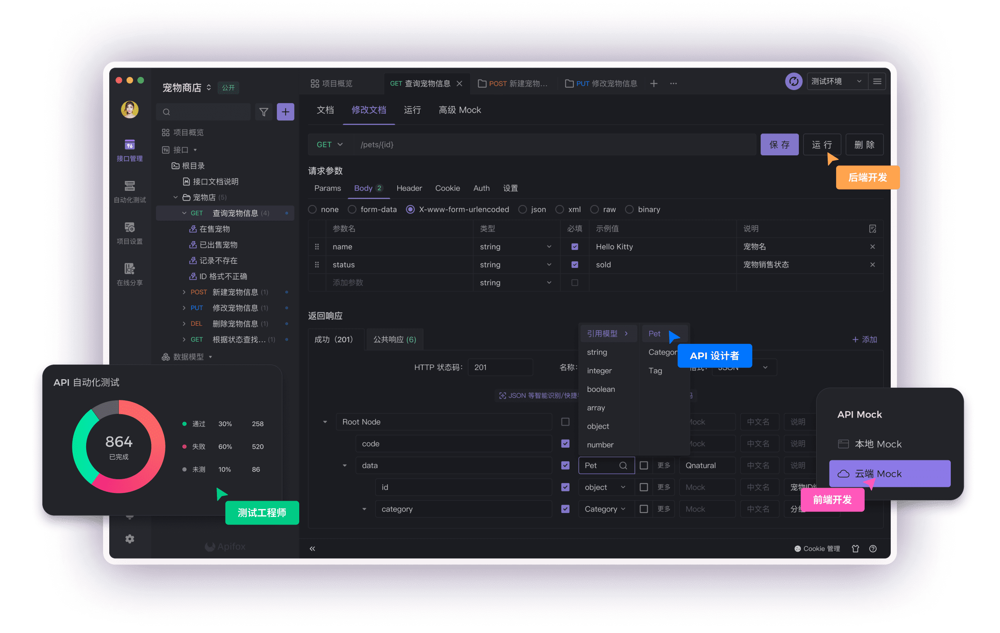
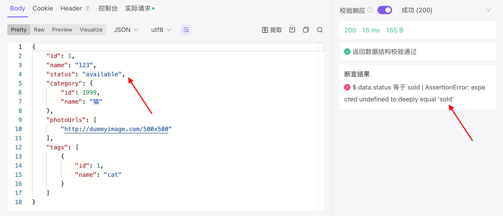
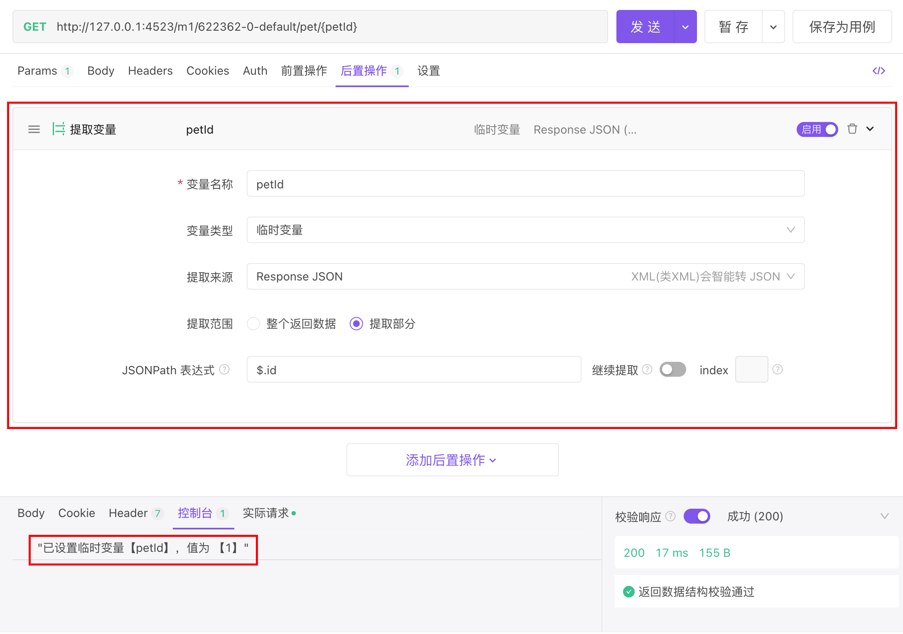
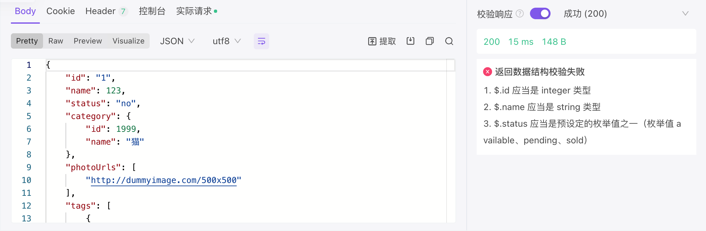
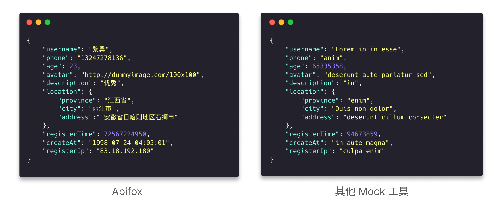
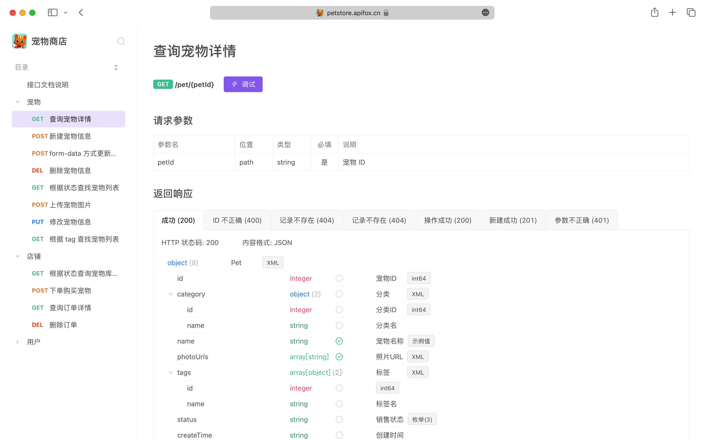

# [Apifox](https://apifox.com/)   API 一体化协作平台

## API 文档、API 调试、API Mock、API 自动化测试 —— API 一体化协作平台

## Apifox = Postman + Swagger + Mock + JMeter

## [API Hub](https://apifox.com/apihub/) 开放 API 共享平台，发现更多公开 API 项目


[Apifox](https://www.apifox.cn/) 是集 API 文档、API 调试、API Mock、API 自动化测试多项实用功能为一体的 API 管理平台，定位为 `Postman + Swagger + Mock + JMeter`。旨在通过一套系统、一份数据，解决多个工具之间的数据同步问题。只需在 Apifox 中定义 API 文档；API 调试、API 数据 Mock、API 自动化测试等功能就可以直接使用，无需再次定义。API 文档和 API 开发调试流程在同一个工具内闭环，API 调试完成后即可确保与 API 文档定义完全一致。高效、及时、准确！



## 接口管理痛点[](https://apifox.com/help/overview/introduction#接口管理痛点)

大多数研发团队通常会使用以下多种工具管理 API 接口：

- 使用 Swagger 管理 API 文档
- 使用 Postman 调试 API
- 使用 mockjs 等工具 Mock API 数据
- 使用 JMeter 做 API 自动化测试

维护不同工具之间数据一致性非常困难、低效。并且这里不仅仅是工作量的问题，更大的问题是多个系统之间数据不一致，导致协作低效、频繁出问题，开发与测试人员痛苦不堪。许多研发团队正在经历以下庞杂的协作场景：

- 架构师在 Swagger 定义好 API 文档后，调试接口时还需要再去 Postman 定义一遍。
- 前端工程师在开发 Mock 数据时需要在 mockjs 进行定义，还需要手动设置 Mock 规则。
- 前端工程师根据 mockjs Mock 返回的数据完成开发，后端工程师根据 Swagger 定义的接口文档进行开发，并且各自都通过了测试流程。结果在进入前后端对接流程时又发现各项不一致问题：
  1. 开发过程中接口变更了，只修改了 Swagger，但是没有及时同步修改 mockjs。
  2. 后端开发的接口数据类型和文档不一致，肉眼难以发现问题。
- 测试工程师在 JMeter 写好的测试用例，真正运行的时候发现接口有更新，导致需要重复回到 JMeter 重新定义接口参数。

随着开发周期的推移，因为团队中存在过于复杂的工具链路，使得每个环节中的不一致性趋于混乱；开发人员的心智负担越来越重，最终变成了整个团队积重难返的技术债务。而 Apifox 能够有效的解决上述问题。

## 产品优势[](https://apifox.com/help/overview/introduction#产品优势)

### 一站式接口协作平台[](https://apifox.com/help/overview/introduction#一站式接口协作平台)

```
Apifox = Postman + Swagger + Mock + JMeter
```

Apifox 是 API 文档、API 调试、API Mock、API 自动化测试一体化协作平台。

通过一套系统、一份数据，解决多个系统之间的数据同步问题。只要定义好接口文档，接口调试、数据 Mock、接口测试就可以直接使用，无需再次定义；接口文档和接口开发调试使用同一个工具，接口调试完成后即可保证和接口文档定义完全一致。高效、及时、准确！

### 接口设计所见即所得[](https://apifox.com/help/overview/introduction#接口设计所见即所得)

Apifox 接口文档遵循 [OpenApi](https://www.openapis.org/) 3.0 (原 Swagger)、[JSON Schema](https://json-schema.org/) 规范的同时，提供了非常好用的`可视化`文档管理功能，零学习成本，非常高效。并且支持在线分享接口文档。同一个接口通常会有多种情况，比如 `正确用例` `参数错误用例` `数据为空用例` `不同数据状态用例`。设计接口时支持定义各个接口的状态。

- 设置断言


运行后，查看断言结果：



- 提取变量



### 一次请求，重复调用[](https://apifox.com/help/overview/introduction#一次请求-重复调用)

无需提前定义接口即可快速调试。支持设置环境变量、前置/后置脚本、Cookie/Session 全局共享等功能。接口运行调试完成后支持一键保存，后续无需输入参数即可重复运行接口用例，十分便利。

### 自动生成代码[](https://apifox.com/help/overview/introduction#自动生成代码)

根据接口模型定义，自动生成各种语言/框架（如 TypeScript、Java、Go、Swift、ObjectiveC、Kotlin、Dart、C++、C#、Rust 等）的业务代码（如 Model、Controller、单元测试代码等）和接口请求代码。目前 Apifox 支持 130 种语言及框架的代码自动生成。

更重要的是：你可以通过`自定义代码模板`来生成符合自己团队的架构规范的代码，满足各种个性化的需求。

自定义脚本支持运行 javascript、java、python、php、js、BeanShell、go、shell、ruby、lua 等各种语言代码。

### 智能化接口管理[](https://apifox.com/help/overview/introduction#智能化接口管理)

使用 Apifox 调试接口的时候，系统会根据接口文档里的定义，自动校验返回的数据结构是否正确。不再需要通过肉眼识别，也无需手动写断言脚本检测。运行接口用例时会自动校验数据正确性，提升调试效率。根据接口及数据数据模型定义，系统还能够自动生成`接口请求代码`、`前端业务代码`及`后端业务代码`。



### 丰富的实用能力[](https://apifox.com/help/overview/introduction#丰富的实用能力)

- **接口数据 Mock**：

内置 [Mock.js](http://mockjs.com/) 规则引擎，非常方便 Mock 出各种数据，并且可以在定义数据结构的同时写好 mock 规则。支持添加“期望”，根据请求参数返回不同 mock 数据。最重要的是 Apifox `零配置` 即可 Mock 出非常人性化的数据。

先放一张图对比下 [Apifox](https://www.apifox.cn/) 和其他同类工具 `零配置` mock 出来的数据效果：



可以看出 Apifox `零配置` Mock 出来的数据和真实情况是非常接近的，前端开发可以直接使用，而无需再手动写 mock 规则。

**Apifox 如何做到`高效率`、`零配置`生成非常人性化的 mock 数据**

1. Apifox 根据接口定义里的数据结构、数据类型，自动生成 mock 规则。
2. Apifox 内置智能 mock 规则库，根据字段名、字段数据类型，智能优化自动生成的 mock 规则。如：名称包含字符串`image`的`string`类型字段，自动 mock 出一个图片地址 URL；包含字符串`time`的`string`类型字段，自动 mock 出一个时间字符串；包含字符串`city`的`string`类型字段，自动 mock 出一个城市名。
3. Apifox 根据内置规则，可自动识别出图片、头像、用户名、手机号、网址、日期、时间、时间戳、邮箱、省份、城市、地址、IP 等字段，从而 Mock 出非常人性化的数据。
4. 除了内置 mock 规则，用户还可以自定义规则库，满足各种个性化需求。支持使用 `正则表达式`、`通配符` 来匹配字段名自定义 mock 规则。

- **数据库操作**：

支持读取数据库数据，作为接口请求参数使用。支持读取数据库数据，用来校验(断言)接口请求是否成功。


- **接口自动化测试**：

提供接口集合测试，可以通过选择接口（或接口用例）快速创建测试集。

### 云端团队协作[](https://apifox.com/help/overview/introduction#云端团队协作)

接口信息云端实时同步更新，天生响应团队协作。成熟的`团队/项目/成员权限`管理系统满足各类企业的需求。数据模型之间支持相互引用，同样的数据结构，只需要定义一次即可多处使用；修改时仅需修改一处，多处实时更新。

- 文档在线分享

Apifox 项目可“在线分享” API 文档，分享出去的 API 文档可设置为公开或需要密码访问，方便与外部团队进行协作。

体验地址：https://petstore.apifox.cn/



### 兼容多种数据格式[](https://apifox.com/help/overview/introduction#兼容多种数据格式)

1. 支持导出 `OpenApi (Swagger)`、`Markdown`、`Html` 等数据格式，因为可以导出`OpenApi`格式数据，所以你可以利用 OpenApi (Swagger) 丰富的生态工具完成各种接口相关的事情。
2. 支持导入 `OpenApi (Swagger)`、`Postman`、`apiDoc`、`HAR`、`RAML`、`RAP2`、`YApi`、`Eolinker`、`NEI`、`DOClever`、`ApiPost` 、`Apizza` 、`ShowDoc`、`API Blueprint`、`I/O Docs`、`WADL`、`Google Discovery`等数据格式，方便旧项目迁移。
3. 支持`定时自动`导入`OpenApi (Swagger)`、`apiDoc`、`Apifox`格式数据。
