# 文章： 2023，我私藏的英语学习工具

在这篇文章中，我会介绍 2023 年对我来说英语学习最有帮助的辅助工具和我自己的使用心得。涵盖范围包括网页、视频、播客、文献阅读、口语练习等。

在这些工具的帮助下，我基本上可以无障碍汲取互联网上的英语知识了。希望它们对你也能有所参考。

## 阅读英文网页

对我来说阅读英文网页的过程中可能会遇到两种情况，情况一是网页上文章里的英文生词较少，情况二则是网页上文章里的英文生词较多。针对这两种情况，我会分别使用[网易有道词典](https://sspai.com/link?target=https%3A%2F%2Fcidian.youdao.com%2Fdownload-app)和[沉浸式翻译插件](https://sspai.com/link?target=https%3A%2F%2Fchrome.google.com%2Fwebstore%2Fdetail%2Fimmersive-translate%2Fbpoadfkcbjbfhfodiogcnhhhpibjhbnh%3Fhl%3Dzh-CN)。

### 网易有道词典

这个软件里我用到的主要功能是屏幕取词功能：选中网页上的单词或者句子会触发翻译图标，点击翻译图标就可以查看该单词或者句子的对应示意。当然如果你喜欢快捷键去触发翻译，有道词典也是支持的。

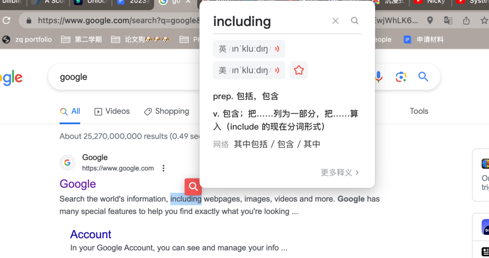

有道词典里面，我一定还会开启的一个设置是自动发音功能，这样在我选中单词进行翻译时，还能一下子听到这个单词是如何发音的，增强对生词的印象。

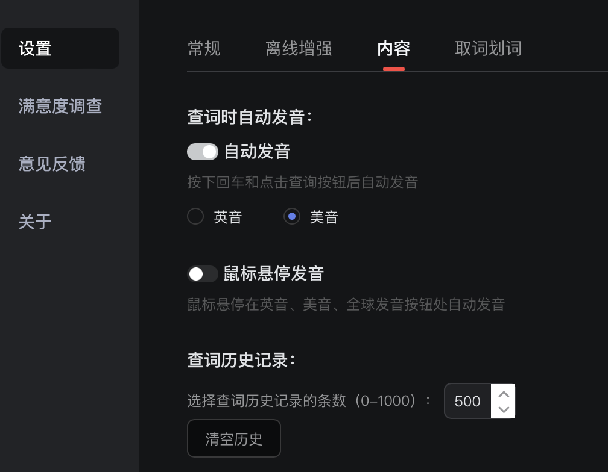

另外网页有道词典除了支持网页上的屏幕取词，电脑上非网页上的文件在打开时也能做到屏幕取词。

### 沉浸式翻译插件

针对网页上英文生词较多的情况，沉浸式翻译则能更好地解决问题。它能很方便地把网页转换为双语的形式。

安装[沉浸式翻译](https://sspai.com/link?target=https%3A%2F%2Fchrome.google.com%2Fwebstore%2Fdetail%2Fimmersive-translate%2Fbpoadfkcbjbfhfodiogcnhhhpibjhbnh%3Fhl%3Dzh-CN)插件后，按下快捷键「option + W」插件就会自动帮你把网页翻译成中英双语的形式，阅读英文生词较多的文章再也不会有心理包袱了。

你可以更改中文翻译显示的样式，比如弱化或者模糊效果等。我自己因为不希望自己太依赖翻译，所以样式上会倾向于使用弱化或者模糊来展示翻译出来的文字。

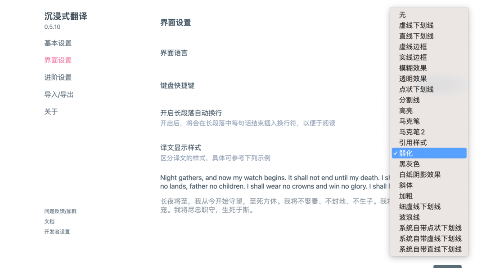

除了让你很方便地去以中英文双语的形式浏览网页，沉浸式翻译还能帮你制作双语 ePub 电子书、翻译本地 PDF 文件等，真的是很强大的一款插件。

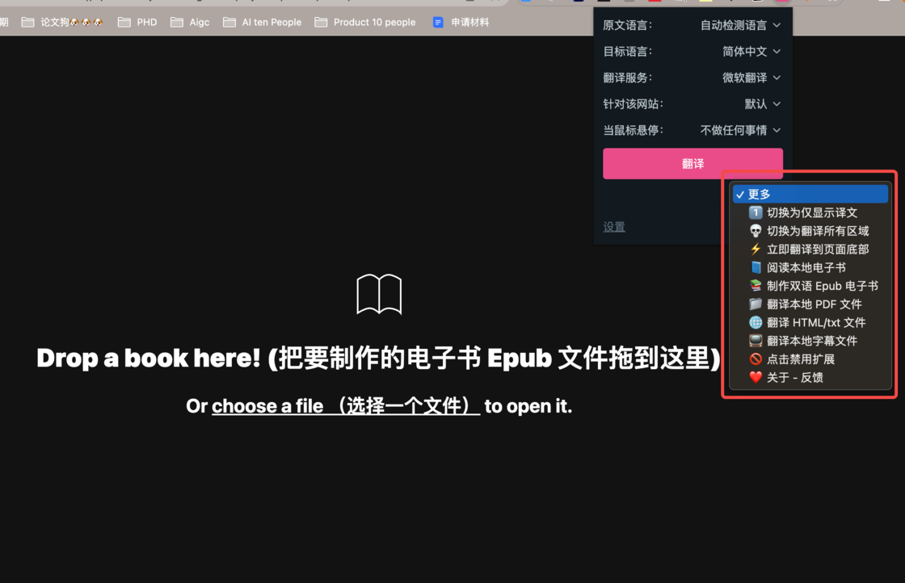

## 观看在线视频：YouTube 双字幕

上学的时候，每次看 paper 我其实都更喜欢先看一下这篇论文、然后在 Youtube 上能不能找到视频资源。如果有的话则会更倾向于去先去看视频，因为视频会把论文中最重要的一些内容都呈现出来。

但有时候很多专业的术语我是听不懂的，知道后来发现了 [YouTube™ 双字幕 - Chrome 应用商店 (google.com)](https://chrome.google.com/webstore/detail/youtube-dual-subtitles/hkbdddpiemdeibjoknnofflfgbgnebcm) 这款插件，它能在视频中显示双语字幕，从此我再也不用担心自己听不懂了。

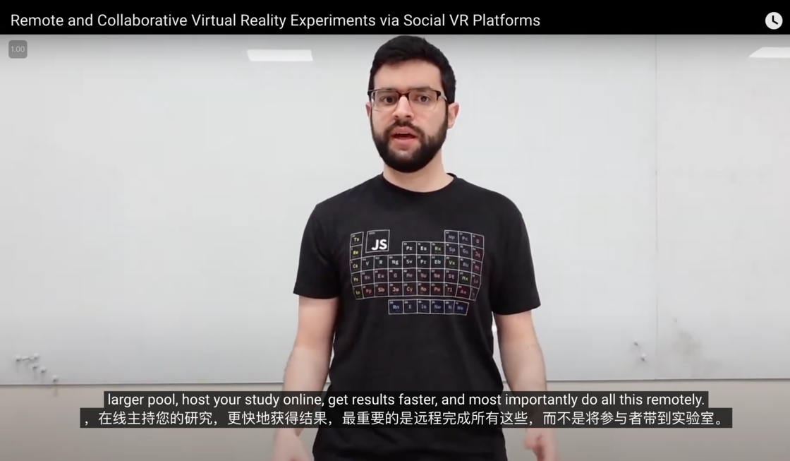

## 科研文献：Scispace

读 paper 如果碰到一篇生词比较多的，我会选择使用 [Scispace](https://sspai.com/link?target=https%3A%2F%2Ftypeset.io%2F) 协助我进行辅助阅读。

Scispace 自己的 Slogan 是做科研界的 ChatGPT，论文中遇到看不懂的地方，你可以用聊天的方式让 Scispace 给你解释选中区域。同时聊天界面右上角还可以设置解释的语言。

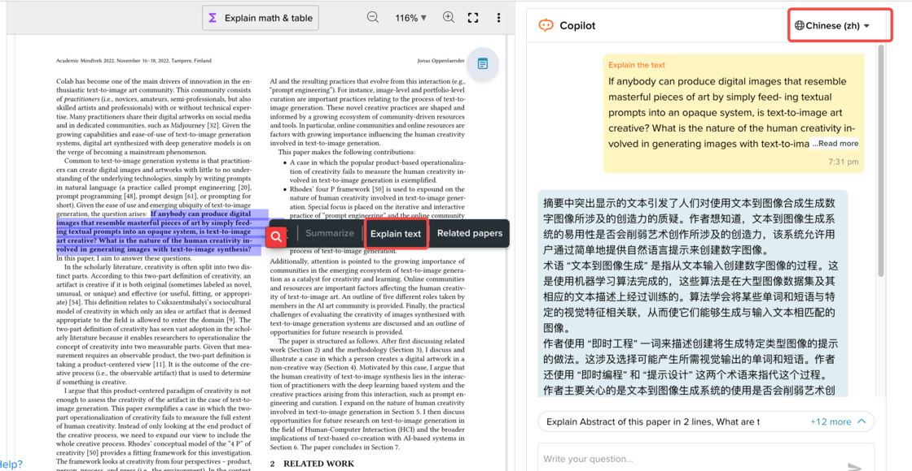

Scispace 是支持 Zotero 导入的，所以你可以很方便的把文章导入到 Scispace 里面。除此之外它还有一个专门的插件叫 [Scispace Copilot](https://sspai.com/link?target=https%3A%2F%2Fchrome.google.com%2Fwebstore%2Fdetail%2Fscispace-copilot%2Fcipccbpjpemcnijhjcdjmkjhmhniiick)，当你在网页中看到一篇 paper 时，点击这个插件就可以调出 Scispace 的聊天页面，展开基于这篇 paper 的对话。但体验下来解析当前网页中的 paper 需要一点时间，希望之后 Scispace Copilot 在使用上能做得更加流畅。

## 英文会议：飞书妙记

写论文的时候我也会和导师定期讨论和论文相关的内容。因为导师是外国人且有一定的口音，会议持续的时间也比较长，最开始听完会议我真是一头雾水。

后面和导师协商了一下，我们每次讨论时我都会录屏。接着我会把我的录屏上传到飞书妙记里，飞书能很好的识别英文，即使有一些口音识别效果也很不错。而且能直接以英文文字去浏览会议中讨论的东西，你可以选中对应的文字高亮做标记，点击文字也能直接定位到视频中对应的位置，很是方便，也让我能更高效地消化每次会议和导师讨论的内容。

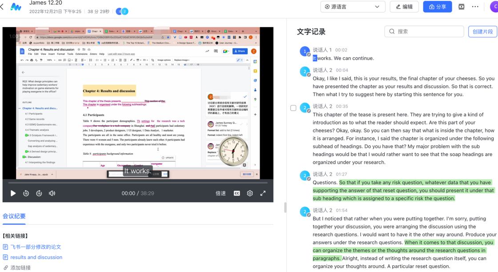

## 口语练习：Myshell.ai

口语练习我目前使用的是 [MyShell](https://sspai.com/link?target=https%3A%2F%2Fmyshell.ai%2F)，一款可以和虚拟人语音聊天的网页工具。你可以用语音的方式选择和自己喜欢的虚拟人聊天，虚拟人则会语音回复你。为了锻炼你的听力，虚拟人回复的内容会使用文字模糊效果，如果你有听不懂的内容，可以去除模糊效果，查看虚拟人说了些什么。

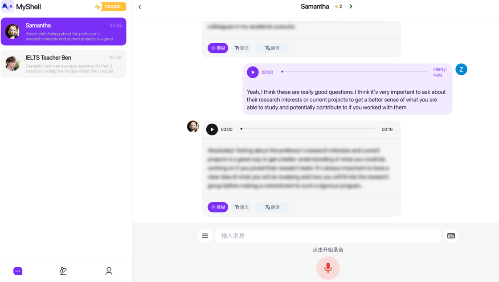

Myshell 的聊天感受还是很好的，一方面是因为平台上虚拟人的音色听起来都很舒服且有特点，在某些话题上还能和我深入地去展开聊天。虽然每天的聊天轮数不是无限的，但每天会有一定数量免费的聊天轮数。如果想要聊更多轮数需要按照平台里的规则努力去升级。

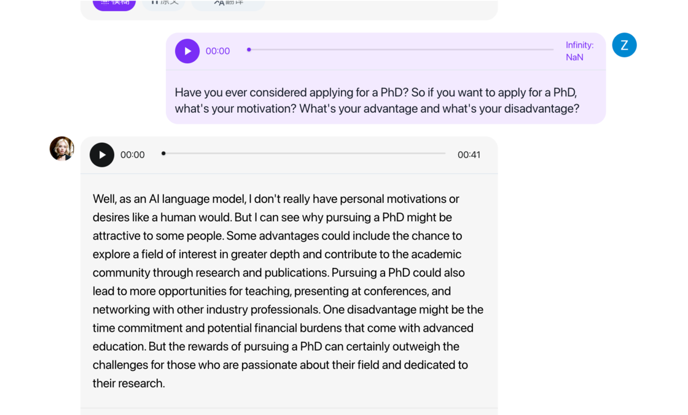

## 播客：Snipd

[Snipd](https://sspai.com/link?target=https%3A%2F%2Fwww.snipd.com%2F) 是一款 AI 播客 App，创始人 Kevin Smith 希望帮助你更好地通过播客的方式去学习知识。Snipd 使用 AI 把长音频拆分成了不同的音频章节，方便你迅速定位到自己最想听的那部分内容。

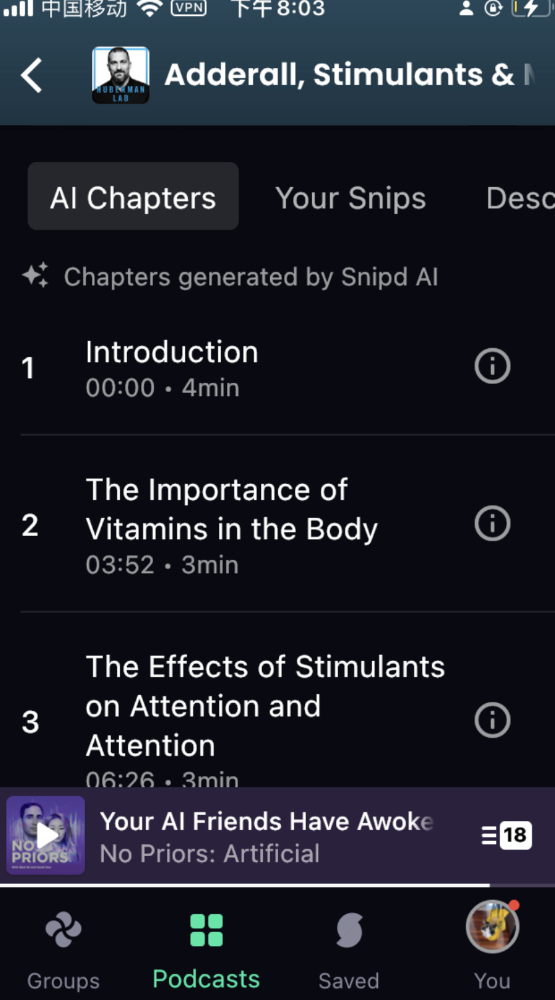

对我来讲，我最喜欢 Snipd 的功能就是它的 Transcript，可以把你正在听的音频实时转录成英文文本。如果我在听播客的过程中有听不懂的地方，就可以去 Transcript 里查看对应内容。

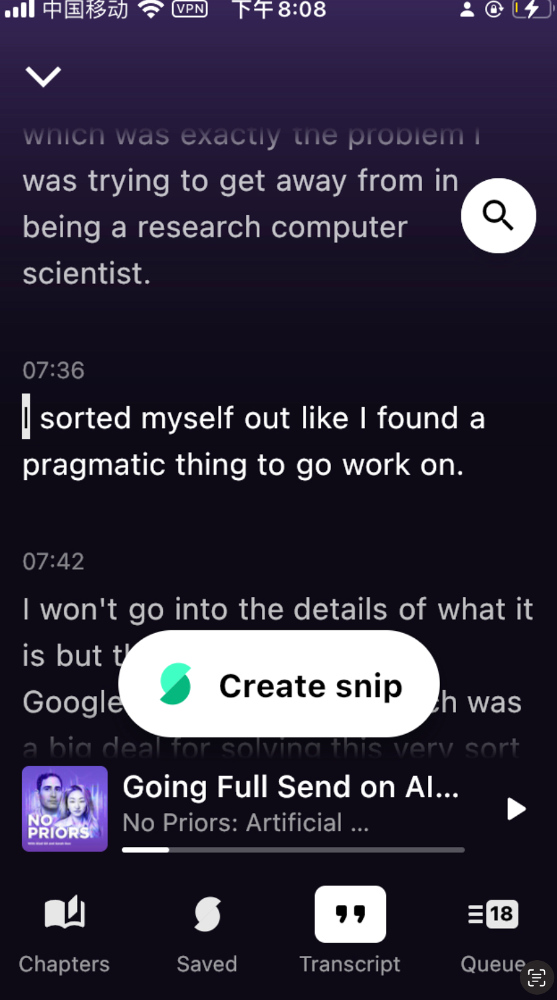

## 总结

最后，一张思维导图帮你总结我这篇文章提到的所有英语学习辅助工具。希望本文对你有所帮助。如果有帮助的话也记得帮我充电！

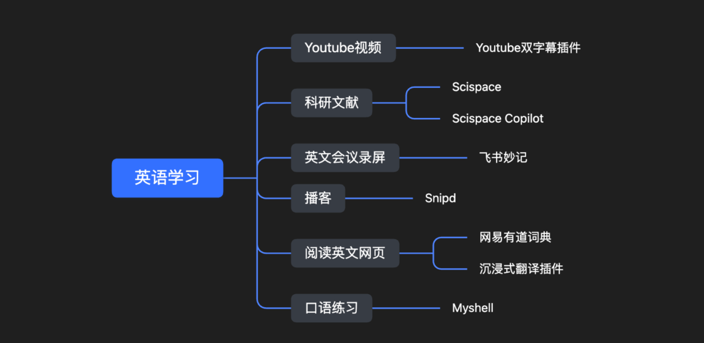
