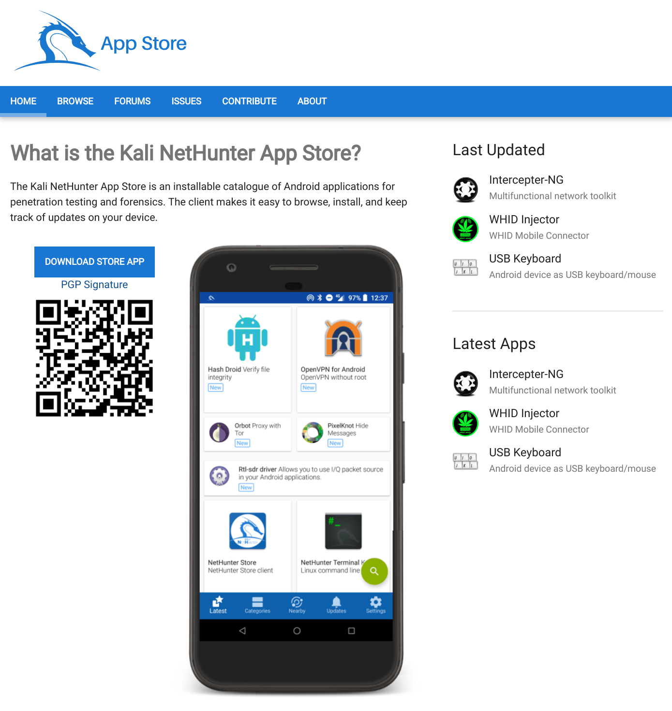
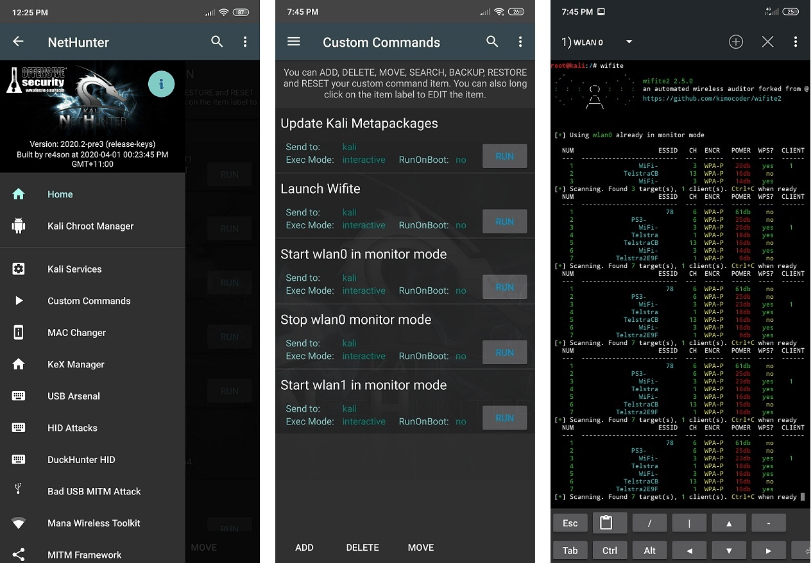

# [F-Droid](http://www.kali.org/docs/nethunter) kali 手机应用商店

Kali NetHunter is available for un-rooted devices (NetHunter Rootless), for rooted devices that have a custom recovery (NetHunter Lite), and for rooted devices with custom recovery for which a NetHunter specific kernel is available (NetHunter).

The core of Kali NetHunter, which is included in all three editions, comprises of:

- Kali Linux container that includes all the tools and applications that Kali Linux provides
- Kali NetHunter App Store with dozens of purpose-built security apps
- Android client to access the Kali NetHunter App Store
- Kali NetHunter Desktop Experience (KeX) to run full Kali Linux desktop sessions with support for screen mirroring via HDMI or wireless screen casting

Figure 2: Kali NetHunter Desktop Experience (KeX) outputting to an HDMI monitor

The Kali NetHunter App Store can be accessed through the dedicated client app or via the web interface.

Figure 3: Kali NetHunter App Store

**Both rooted editions provide additional tools & services**. A custom kernel can extend that functionality by adding additional network and USB gadget drivers as well as wifi injection support for selected wifi chips.

Figure 3: The Kali NetHunter App is available in both rooted editions (NetHunter Lite & NetHunter).

Beyond the [penetration testing tools](https://www.kali.org/tools) included in Kali Linux, NetHunter also supports several additional classes, such as **HID Keyboard Attacks**, **BadUSB attacks**, **Evil AP MANA attacks**, and many more.

For more information about the moving parts that make up NetHunter, check out our [NetHunter Components](https://www.kali.org/docs/nethunter/nethunter-components/) page. Kali NetHunter is an [Open-source project](https://www.kali.org/docs/policy/kali-linux-open-source-policy/) developed by [Kali](https://www.kali.org/) and the community.
