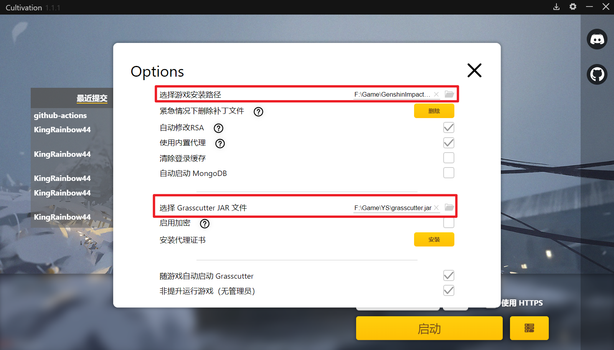
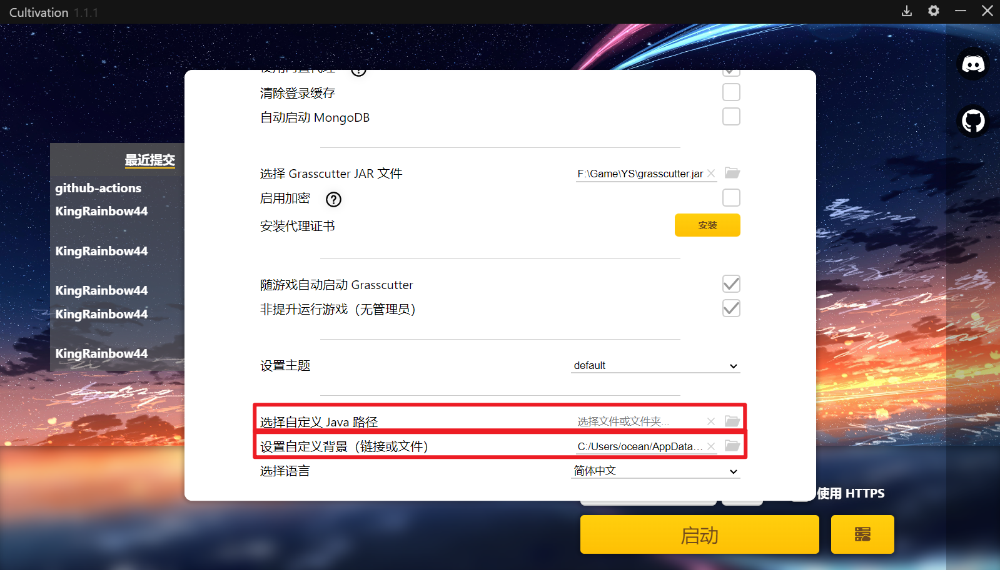
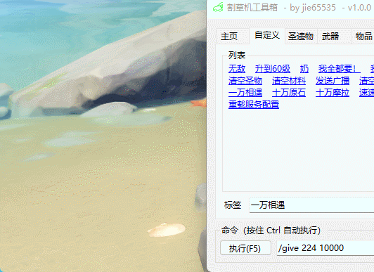

# 原神私服搭建教程

## 网址list

- ### [Grasscutter](https://github.com/Grasscutters/Grasscutter) 核心服务端 `grasscutter.jar` 

- ### [GrasscutterCommandGenerator](https://github.com/jie65535/GrasscutterCommandGenerator) GcTool

- ### [gc-opencommand-plugin](https://github.com/jie65535/gc-opencommand-plugin) GcTool服务器插件jar包

- ### [Cultivation](https://github.com/Grasscutters/Cultivation) 客户端启动代理

- ### [GC-Resources](https://gitlab.com/YuukiPS/GC-Resources) GC服务端资源文件  `resources` 

- ### [GI-Download-Library](https://github.com/MAnggiarMustofa/GI-Download-Library) 各版本【客户端】和【音频文件】下载

## 食用步骤

- 获取Java 17：https://www.oracle.com/java/technologies/javase/jdk17-archive-downloads.html

- 获取[MongoDB社区版](https://www.mongodb.com/try/download/community)

- 获取游戏3.7正式版 (如果你没有3.7的客户端，可以在这里找到）：https://github.com/MAnggiarMustofa/GI-Download-Library/blob/main/GenshinImpact/Client/3.7.0.md)

- 下载[最新的Cultivation版本](https://github.com/Grasscutters/Cultivation/releases/latest)（使用以“.msi”为后缀的安装包）。

- 以管理员身份打开Culivation，按右上角的下载按钮。

- 点击“下载 Grasscutter 一体化”

- Grasscutter 一体化下载太慢，可以自己下载 `resources` + `grasscutter.jar` + `客户端`，然后在Culivation配置grasscutter.jar、客户端，还可以自定义java路径、背景图片。

  

- 点击“启动”按钮：旁边的小按钮，启动服务器，这时`grasscutter.jar`所在文件夹下会自动生成一些列文件夹，将下载好的`resources`文件复制到resources文件夹中，这时候就可以正常食用了。
- 点击“启动”按钮：同时启动客户端和服务器

## 食用GCTool 

服务端需要 [gc-opencommand-plugin](https://github.com/jie65535/gc-opencommand-plugin) 插件支持

1. 在 [Release](https://github.com/jie65535/gc-opencommand-plugin/releases) 下载 `jar`
2. 放入 `plugins` 文件夹即可

### 控制台连接

1. 首次启动时，会在 `plugins` 目录下生成一个 `opencommand-plugin` 目录，打开并编辑 `config.json`
2. 设置 `consoleToken` 的值为你的连接秘钥，建议使用至少32字符的长随机字符串。
3. 重新启动服务端即可生效配置
4. 在客户端中选择控制台身份，并填写你的 `consoleToken` 即可以控制台身份运行指令

具体可以参考readme：[gc-opencommand-plugin: readme](https://github.com/jie65535/gc-opencommand-plugin#readme)

