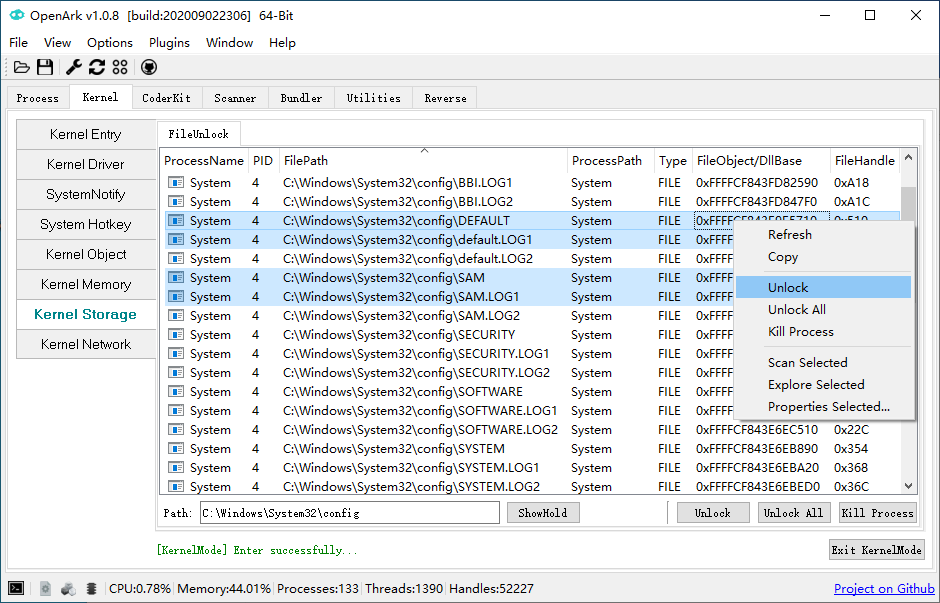
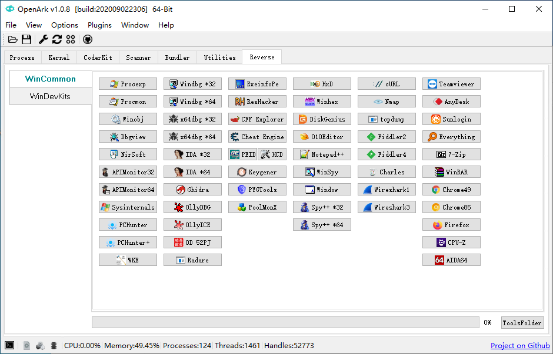
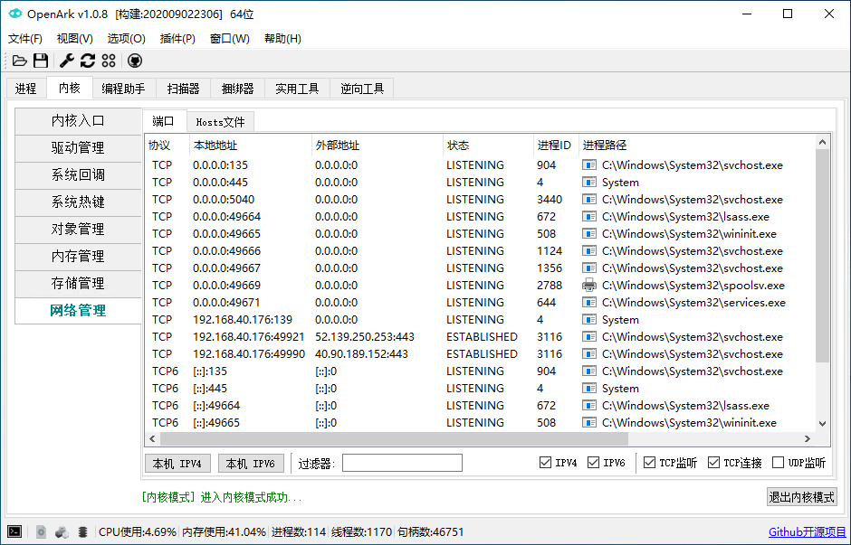

# [OpenArk](https://github.com/BlackINT3/OpenArk) Windows平台上的开源Ark工具箱

Ark是Anti-Rootkit（对抗恶意程序）的简写, OpenArk目标成为逆向工程师、编程人员的工具。

[OpenArk - Opensource Anti Rootkit (blackint3.com)](https://openark.blackint3.com/)








## 功能
```
进程 - 查看进程、线程、模块、句柄、内存、窗口等信息，还有进程注入等功能。
内核 - 系统内核工具，例如：内存管理、驱动、热键、回调、过滤驱动、存储、IDT/SDT/NDIS/WFP等功能。
编程助手 - 程序员的工具箱。
扫描器 - PE/ELF文件解析器，以后会变成病毒分析助手。
捆绑器 - 目录和多个程序可以捆绑成一个exe程序，同时支持脚本。
实用工具 - 垃圾清理功能、系统工具等等。
逆向工具 - 精心挑选了许多有用的小工具，这些和OpenArk既有功能互补，高效率，我们一直在思考。
控制台 - 这里有很多有用的命令。
语言 - 目前支持中文和英文，以后会支持更多。
更多强大的功能正在开发中。。。
```


## 使用手册

- 内核
  - [查看被占用的系统热键](https://openark.blackint3.com/manuals/CN/内核/查看被占用的系统热键/)
  - [解锁被占用的文件](https://openark.blackint3.com/manuals/CN/内核/解锁被占用的文件/)
- 扫描器
  - [查看PE文件结构](https://openark.blackint3.com/manuals/CN/扫描器/查看PE文件结构/)
- 捆绑器
  - [制作一个捆绑程序](https://openark.blackint3.com/manuals/CN/捆绑器/制作捆绑程序/)
- 编程助手
  - [时间戳转换](https://openark.blackint3.com/manuals/CN/编程助手/时间戳转换/)
  - [查看文字编码](https://openark.blackint3.com/manuals/CN/编程助手/查看文字编码/)
  - [查看窗口消息ID](https://openark.blackint3.com/manuals/CN/编程助手/查看窗口消息ID/)
  - [系统错误值查看](https://openark.blackint3.com/manuals/CN/编程助手/系统错误值查看/)
  - [进制转换](https://openark.blackint3.com/manuals/CN/编程助手/进制转换/)
- 进程管理
  - [创建进程Dump](https://openark.blackint3.com/manuals/CN/进程管理/创建进程Dump/)
  - [定位进程文件](https://openark.blackint3.com/manuals/CN/进程管理/定位进程文件/)
  - [批量结束进程](https://openark.blackint3.com/manuals/CN/进程管理/批量结束进程/)
  - [查看内存信息](https://openark.blackint3.com/manuals/CN/进程管理/查看内存信息/)
  - [查看进程基本信息](https://openark.blackint3.com/manuals/CN/进程管理/查看进程基本信息/)
  - [查看进程模块](https://openark.blackint3.com/manuals/CN/进程管理/查看进程模块/)
  - [查看进程窗口](https://openark.blackint3.com/manuals/CN/进程管理/查看进程窗口/)
  - [查看进程线程](https://openark.blackint3.com/manuals/CN/进程管理/查看进程线程/)
  - [模糊查找进程](https://openark.blackint3.com/manuals/CN/进程管理/模糊查找进程/)
  - [通过PID选择进程](https://openark.blackint3.com/manuals/CN/进程管理/通过PID选择进程/)
- 注入
  - [注入Dll到进程](https://openark.blackint3.com/manuals/CN/进程管理/注入/注入Dll到进程/)
