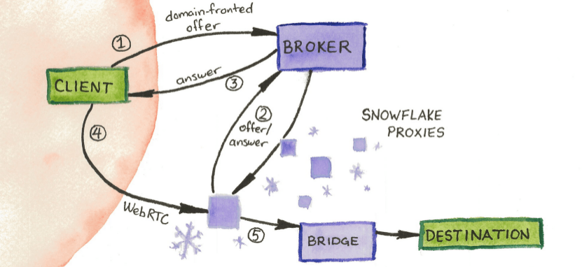
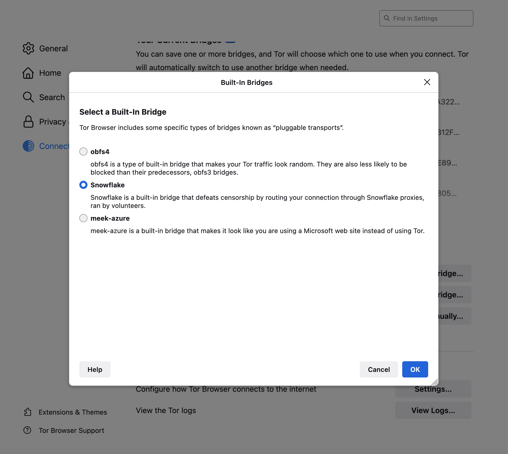

# SNOWFLAKE



Snowflake 是一种**容许来自世界各地的人们访问被审查网站**的系统。类似 VPN 协助绕开互联网审查，Snowflake 采用伪装互联网活动的手段，看起来像是在互联网进行普通视频或语音通话，有助于避免引起互联网审查机构的注意。

像是 Snowflake 一样，种类繁多且使用不同技术的工具正对互联网活动进行“变革”。一些被重定向的互联网流量像是来自 Microsoft Azure 和 Amazon Web Services 等流行的云服务提供商。其他互联网流量被扰码可使其完全随机显现。

审查机构将需要屏蔽大部分区域的互联网，从而达到屏蔽此类规避工具的初期目的，故此将付出巨大的代价。

## 使用 Snowflake 绕开审查

不像 VPN，你不需要安装单独的应用程序连接 Snowflake 代理规避审查。现有应用中通常内置了规避审查的功能。目前 Snowflake 在桌面版和 Android 版的 [Tor 浏览器](https://torproject.org/download)，iOS 版 [Onion 浏览器](https://onionbrowser.com/)，还有 Android 版和 iOS 版 [Orbot](https://orbot.app/) 可用。如果你已下载并安装以上任一应用，而且这些应用在你的国家遭到审查时，你可以在应用中设置页面里激活 Snowflake 规避审查。



## 帮助他人规避审查：运营 Snowflake 代理

你是否知道 Snowflake 代理由志愿者运营的这一事实？换言之，用户连接每一个随机的 Snowflake 代理，都是由像你一样的志愿者运营！因此，如果你想帮助他人规避审查，请考虑安装和运行一个 Snowflake 代理。唯一的先决条件是需要所在国家的网络**还没有**遭到严重审查。

你可以加入世界各地数以千计的志愿者中来，一起安装并运行 Snowflake 代理。无需担心人们直接通过你的 Snowflake 代理访问网站。他们浏览所用的可见 IP 地址是 Tor 出口节点，而不是你的 IP 地址。

这里有多种运行 Snowflake 代理的方式（初学至进阶程度）：

### 安装 Web 扩展

使用 Web 扩展是运行 Snowflake 最容易的方式。仅需在 [Firefox](https://addons.mozilla.org/en-US/firefox/addon/torproject-snowflake/) 或 [Chrome](https://chrome.google.com/webstore/detail/snowflake/mafpmfcccpbjnhfhjnllmmalhifmlcie) 安装并启用这个扩展，用户连接上你的代理时就会看到图标变绿！


### 保持此浏览器标签页开启或在网站中嵌入 Web 徽章

如果打开下面 Snowflake 开关并保持浏览器标签页开启，用户就能连接到新建的代理！

<iframe src="https://snowflake.torproject.org/embed.html" width="320" height="240" frameborder="0" scrolling="no" style="box-sizing: border-box;"></iframe>

此外，你可以自行在自己搭建的网站页面（例如 [relay.love](https://relay.love/)）中嵌入 Snowflake 代理。访问者可以进入页面启动代理，并保持开启状态架设代理（行为和外观与其 Web 扩展类似）。

```js
<iframe src="https://snowflake.torproject.org/embed.html" width="320" height="240" frameborder="0" scrolling="no"></iframe>
```


### 运行独立代理

如想在电脑或服务器运行 Snowflake 代理的命令行版本，参见有关运行 Snowflake 独立代理的[指南](https://community.torproject.org/relay/setup/snowflake/standalone/)。

## 寻求使用 Snowflake 的支持

假若使用 Snowflake 尝试连接 Tor 遇到了问题，[Telegram](https://t.me/TorProjectSupportBot) 上可以找到 Tor 支持频道。你也可以通过浏览 [Tor 支持门户](https://support.torproject.org/censorship/)和 [Tor 论坛](https://forum.torproject.net/tag/snowflake)寻求解决办法。

## 报告缺陷

如果你在使用或运行 Snowflake 遇到问题，请考虑发送错误报告。发送错误报告的方式有两种：

1. 在 Tor Project 的 GitLab 上[申请一个账号](https://gitlab.onionize.space/)，然后在 Snowflake 项目中[提交一个新的问题](https://gitlab.torproject.org/tpo/anti-censorship/pluggable-transports/snowflake/-/issues)。
2. 生成一个标识符登录系统，再发送[匿名工单](https://anonticket.onionize.space/)。接着，在**项目列表**里找到 Snowflake 项目，并创建新的问题。

请在工单中尽可能客观描述你遇到的情况，如有可能，请同时报告日志信息，这将有助于我们重现缺陷。

## 了解更多有关 Snowflake 如何运作的信息

Snowflake 是一种规避审查的新技术，同时也是[可插拔传输](https://gitweb.torproject.org/torspec.git/tree/pt-spec.txt)家族的一员，还在不断改进中。若想了解有关其架构的更多信息？请随意翻看这篇[技术概览](https://gitlab.torproject.org/tpo/anti-censorship/pluggable-transports/snowflake/-/wikis/Technical Overview)（英文）。

若有兴趣在你的应用使用 Snowflake，请联系[反审查团队。](https://lists.torproject.org/cgi-bin/mailman/listinfo/anti-censorship-team)