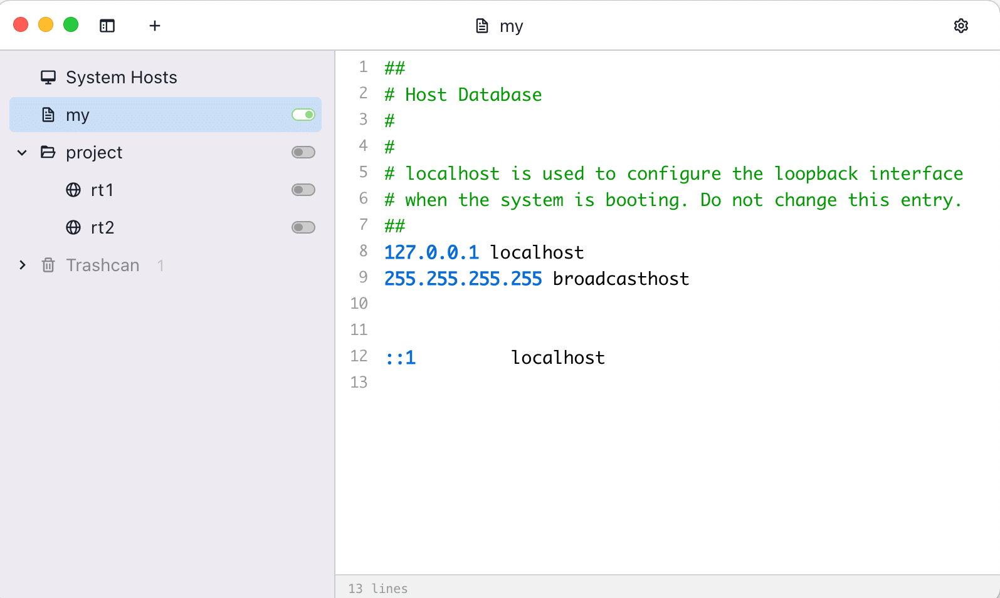

# [SwitchHosts](https://github.com/oldj/SwitchHosts) 管理、切换多个 hosts 方案的工具

> SwitchHosts 是一个管理、切换多个 hosts 方案的工具。
> 它是一个免费开源软件。

## 功能特性

【语法高亮】使用不同的颜色显示 IP、域名以及注释，各类信息一目了然。

【方案多选】通过多选模式组合不同方案，完成复杂环境的配置。

【托盘窗口】在系统托盘菜单显示快捷菜单，点击可快速查看/切换 hosts 方案。

【远程方案】支持本地和远程方案，可从网络下载并自动定时同步远程方案。

【导入 & 导出】可方便地将本地所有方案导出，分享给团队其他成员。

【快速注释】点击行号，或者使用快捷键 `Ctrl+/`（macOS 下为 `⌘+/`），可快速切换指定行的注释状态。

【夜间模式】支持明亮模式和夜间模式，可根据你的偏好随意切换。

【Alfred 支持】与 Alfred 集成，可通过 [Workflow](https://www.packal.org/workflow/switchhosts) 快速切换 hosts。