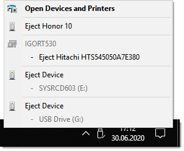
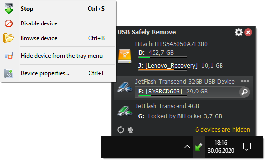
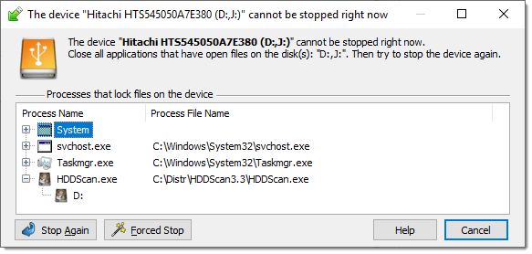
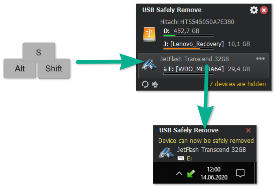
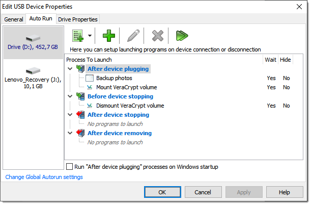
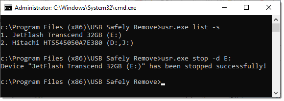
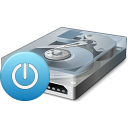
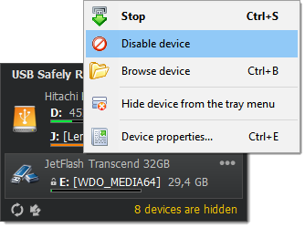
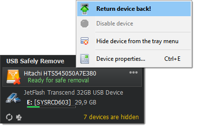
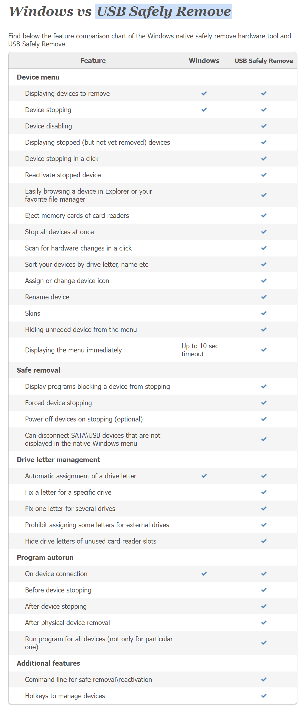

# [USB Safely Remove](https://safelyremove.com/index.htm) 安全移除USB设备

## Features

[Compare USB Safely Remove with native Windows safe removal tool](https://safelyremove.com/usbsafelyremove-vs-windows.htm)

### A handy menu to stop devices

The main disadvantage of using the built-in Windows safe removal tool is that when using several hot-plug devices it is often quite difficult to recognize which device needs to be stopped. Most devices have the same name: "USB mass storage device". In addition, Windows does not let you hide a device you would not want to stop from the menu.

USB Safely Remove saves you from these problems and offers an original and multifunctional stopping menu, which displays actual device names with icons. Using this menu you can find and stop a device in a snap!

Also, this menu allows you to:

- Rename a device
- Change a device image
- [Hide a device from the menu](https://safelyremove.com/help/ht_hideDevice.htm)
- Scan for hardware changes
- Stop all devices at once
- [Disable a device](https://safelyremove.com/help/ht_disableDevice.htm)

### The device cannot be stopped right now. Why?

Ever encountered the situation when Windows does not allow you to remove a device? Unlike Windows, USB Safely Remove will show you the programs which prevent the device from being stopped and let you close these programs or just the files they opened on the device.

[Know more...](https://safelyremove.com/help/ui_cannotStopWindow.htm)

### Keyboard shortcuts to safe removal

Like to do everything using the keyboard? Now you can stop and view devices with only ONE hotkey! No need to remember keyboard shortcuts for each device. Being in any application, press the key combination (Win+S by default) and you will see the stop menu. Use the Up\Down Arrow keys to select the device you need and either press Enter to stop it or Ctrl B to view the contents of a device disk. Also you can assign a dedicated hotkey to stop a certain device.

[Know more...](https://safelyremove.com/help/ht_useHotkeys.htm)

### Program autorun on device connection\disconnection

Another USB Safely Remove feature that distinguishes it from similar software is starting any applications not only after connecting a device, but also *before* removing it. The autorun feature allows you to set up data backup before disconnecting a removable hard drive, to run Total Commander with the contents of the pen-drive, automatically unmount an encrypted TrueCrypt drive before disconnecting the USB media, etc.

[Know more...](https://safelyremove.com/help/ht_useAutoRun.htm)

### Command line to safe removal

USB Safely Remove has a powerful and convenient command line: usr.exe. It allows you to automate work with devices. For example, you can automatically stop devices according to schedule or in case of any other event. In addition the command line tool of "USB Safely Remove" allows to "return device back".

[Know more...](https://safelyremove.com/help/ht_usecommandline.htm)

### Work with any hot-plug devices - USB, SATA, FireWire, PCMCIA

Another important difference between the program and the standard Safely Remove Hardware icon is the possibility to see and stop *any kinds of hotplug devices*. If USB Safely Remove does not display the device you need, try enabling the "Display all storage devices" checkbox in the program options.

### Power off drives on stopping

When you stop the device Windows 10 leaves USB ports powered on. This causes the flash drive continue lighting and the hard drive continue spinning. All modern hard drives park theirs heads automatically when you unplug them so in theory this behavior shouldn’t lead to data looses or drive damages. But in practice the hard drive usually sound strangely when you unplug them on run and this makes a hard drive owner being a bit nervous when he hears that. USB Safely Remove can change this behavior and allow you to power off the device on its stopping.

### Device Disabling

Besides the usual prepare to safe removal you can also disable devices permanently. This is useful to prevent malware to access your drives while they are inactive or to save power consumption. When you need a drive you can enable it back in a click.

### Return Device Back!

After you had stopped the device, but still did not unplug it, sometimes it is quite useful to return it back into the system. For example if you remembered that you forgot to write a file to the external drive. In order to do it, you have to physically reconnect the device, however sometimes it's quite inconvenient to do, e.g. if the device is connected to the rear panel of the computer.

## Windows vs USB Safely Remove

