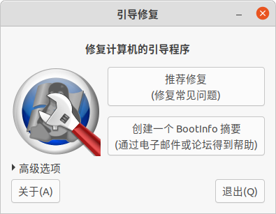
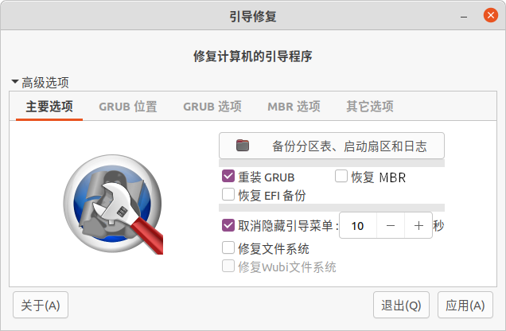
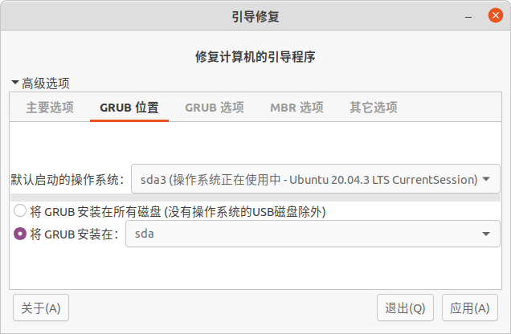
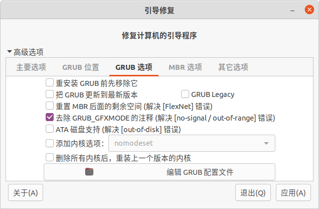
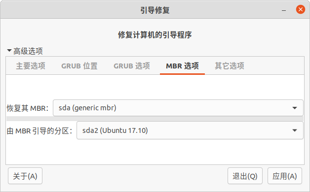
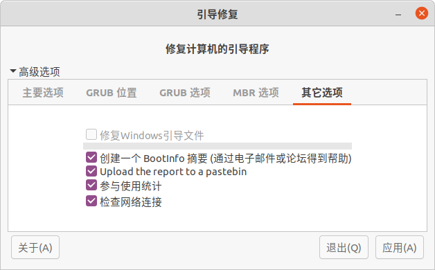

# [boot-repair](https://sourceforge.net/p/boot-repair/home/cn/) GRUB启动引导修复工具


启动盘ISO:[boot-repair-disk](https://sourceforge.net/p/boot-repair-cd/home/Home/)

```bash
# 安装与使用boot-repair
sudo add-apt-repository ppa:yannubuntu/boot-repair && sudo apt update
sudo apt install -y boot-repair && boot-repair
```


# Boot-Repair (引导修复), 找回操作系统的简便工具

- 易用（一键修复！）
- 免费（GPL 开源许可证）
- 帮助（Boot-Info 摘要，可通过电子邮件或您喜欢的论坛获取帮助)
- 安全（自动备份）
- 可靠 (每年 400.000 个用户)
- 可以恢复对Windows的访问 (XP, Vista, Windows7, Windows8, Windows10, Windows11)
- 可以恢复对Debian，Ubuntu，Mint，Fedora，OpenSuse，ArchLinux的访问。
- 可以恢复对任何操作系统（Windows，MacOS，Linux..）的访问，如果您的计算机包含Debian，Ubuntu，Mint，Fedora，OpenSuse，ArchLinux或衍生产品。
- 当您出现"GRUB Recovery"错误消息时，可以修复启动
- 轻松重新安装 GRUB2/GRUB1 引导加载程序的选项（默认情况下，操作系统、清除、取消隐藏、内核选项等）
- 还有更多！（UEFI， SecureBoot， RAID， LVM， Wubi， 文件系统修复...）



**获取 BOOT-REPAIR:** 磁盘上安装的任何操作系统,

- 在 Debian（或衍生产品：Ubuntu、Linux Mint...）磁盘上启动，可以是普通会话，要么是 live-CD，要么是 live-USB。然后在其中安装 Boot-Repair，通过 Ubuntu/Mint 的 [PPA](https://help.ubuntu.com/community/Boot-Repair)，或Debian的 [DEBs](https://launchpad.net/~yannubuntu/+archive/boot-repair/+packages)。
- 或者：在 [Boot-Repair-Disk](https://sourceforge.net/projects/boot-repair-cd/files/) 光盘上启动。Boot-Repair 将自动启动。

**使用 BOOT-REPAIR:**
启动Boot-Repair，然后单击"建议修复"按钮。修复完成后，在纸上写下屏幕上显示的URL(paste.ubuntu.com/XXXXX) ，然后重新启动并检查是否恢复了对操作系统的访问权限。 如果修复未成功，请指示要 boot.repair@gmail.com 的 URL 以获取帮助。
警告：高级选项的默认设置是"建议修复"使用的设置。改变它们可能会使你的问题恶化。在征求意见之前，不要修改它们。

**获取帮助:** 通过电子邮件 (boot.repair@gmail.com)








