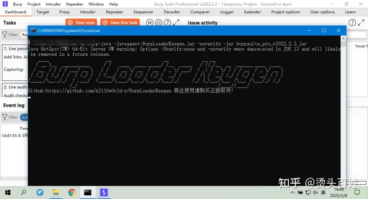

# burpsuit_pro 破解

### 环境准备

下载Burpsuite Pro 2022.2.2 Jar文件、注册机、jdk

```text
 Burpsuite：https://portswigger.net/Burp/Releases
 注册机：https://github.com/h3110w0r1d-y/BurpLoaderKeygen/releases
 jdk：https://www.oracle.com/java/technologies/downloads/#jdk17-windows
```


### 破解步骤

### 1、安装好jdk并配置好环境变量，将下载好的两个jar文件放在同一个文件夹下。 


### 2、直接运行注册机：BurpLoaderKeygen.jar文件，双击或者使用 java -jar命令打开也可以。注册机会自动识别目录下的burpsuite_pro_v2022.2.2.jar文件，并且自动添加参数。 


**点击run，启动burpsuite。**


**当出现这个界面，说明已经破解完成，点击 Next 可以直接使用了。**

### 3、Diy自己的license信息： **点击Help——>Clean Burp from computer** 


**勾选 Remove Burp license key，点击Next**


**再次点击run的时候，就会跳出重新注册的界面**


**Diy自己的license信息：**


**将BurpLoaderKeygen.jar界面上的License信息复制到burpsuite上面：**


**点击Next**


**点击Next，完成激活**


### 4、创建bat文件启动Burpsuite

### **由于每次启动burpsuite都要先运行BurpLoaderKeygen.jar，然后再点击run，这样很不方便，所以我们写一个启动程序来直接启动burpsuite** **在同目录下创建burpsuite.bat文件，内容如下：**

```bat
java -javaagent:BurpLoaderKeygen.jar -noverify -jar burpsuite_pro_v2022.2.2.jar
```


**双击burpsuite.bat文件，直接启动burpsuite**


### 5、解决掉CMD窗口问题


**我们运行完bat文件打开burpsuite后，会出现一个CMD窗口，并且这个窗口不可以关掉，关掉的话，burpsuite也会直接关掉，我们更改一下burpsuite.bat文件里的内容来解决这个问题**



```text
 start javaw -javaagent:BurpLoaderKeygen.jar -noverify -jar burpsuite_pro_v2022.2.2.jar
```


**这样就不会有CMD窗口啦！**

### 6、创建桌面快捷方式

**添加自己的burpsuite.bat文件路径**


**名字随便取**


**添加上图标就可以啦！**

