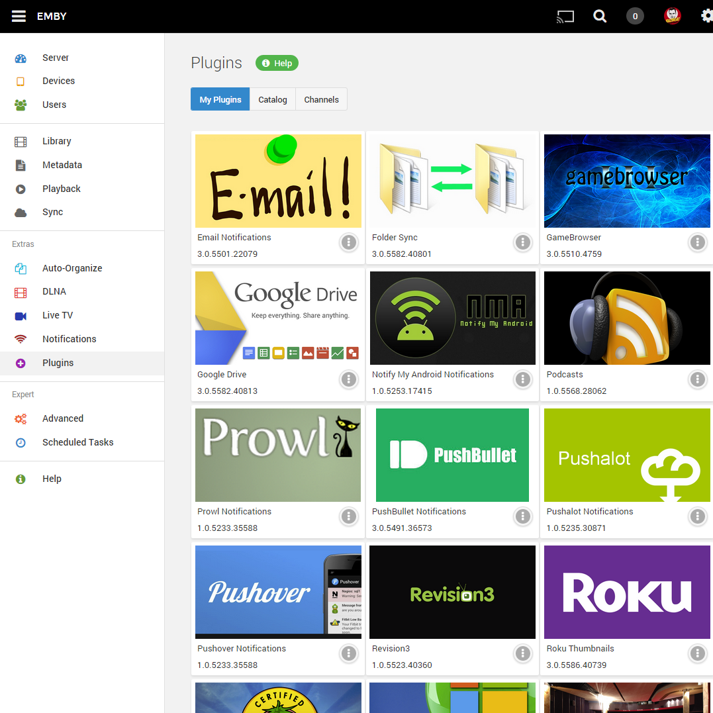
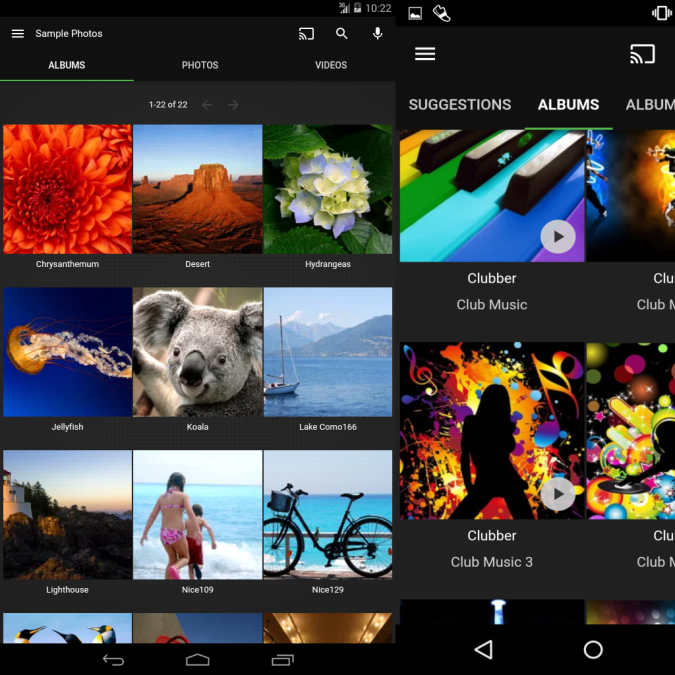
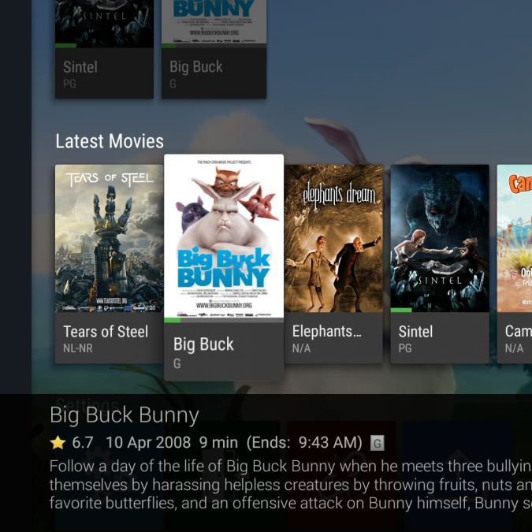

# [Emby](https://emby.media/)

[
任何设备上的媒体](https://emby.media/about.html#)

Emby Server 会自动转换和流式传输您的个人媒体，以便在任何设备上播放。

[轻松访问](https://emby.media/connect.html)

Emby Connect 让您在出门在外时也能轻松享受您的个人媒体。只需登录即可玩。

[电视直播](https://emby.media/about.html#)

将直播电视流式传输到任何设备，管理您的 DVR，并享受您的录音库。

[移动同步](https://emby.media/about.html#)

将您的个人媒体同步到智能手机和平板电脑，以便轻松离线访问。添加新内容时自动同步。

[管理你的家](https://emby.media/about.html#)

轻松控制孩子的内容访问。根据需要监视和远程控制他们的会话。

[Chromecast的](https://emby.media/about.html#)

轻松将视频、音乐、照片和直播电视发送到 Chromecast。

[精美的显示器](https://emby.media/about.html#)

Emby 将您的内容组织成简单而优雅的演示文稿。您的个人媒体将永远不会看起来一样。

[家长控制](https://emby.media/about.html#)

为您的孩子指定家长限制、创建访问时间表、时间限制等。

[云同步](https://emby.media/about.html#)

将您的个人媒体同步到云端，以便轻松备份、存档和转换。以多种分辨率存储您的内容，以便从任何设备直接流式传输。

#### Web-Based Management

Powerful tools to manage your content, users, sharing, security, and more. The Emby Server dashboard is designed for smart phones, tablets, and big screens, allowing you to manage your media anytime, anywhere.

#### Mobile Apps

Take your personal home videos, music, and photos with you wherever you go, even offline with Emby Mobile Sync. Emby apps are available for Android, iPhone, iPad, Windows Phone and Windows Tablets.

#### TV Apps

Sit back and enjoy Emby from the living room. Emby apps are available for Android TV, Amazon Fire TV, Chromecast, Roku, Xbox, Home Theater Computers, and more.

## [Emby Documentation](https://emby.media/support/articles/Home.html)

