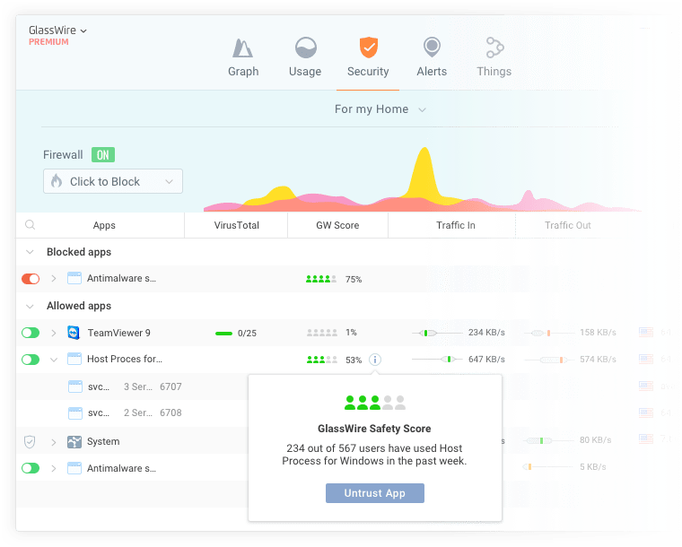

# glasswire

## Privacy & Security Features

- Instantly see who or what your PC is talking to on GlassWire's network monitoring graph, plus see what your PC may have connected to in the past.
- Detect spyware, malware, badly behaving apps, and bandwidth hogs, then block their connections.
- GlassWire warns you of network related changes to your PC, or unusual changes to your apps that could indicate malware.
- Monitor other PCs on your network and get alerted when new unknown devices join your WiFi.

## Network Data Usage Monitoring

- Keep track of your data usage on your PC or [mobile phone](https://www.glasswire.com/glasswire-for-android/) and get alerted before going over data limits.

- Go back in time with GlassWire's network time machine to see what your PC was doing while you were away.

- Get alerted every time a new app accesses the network, and block it if necessary.

- See detailed network usage statistics broken down by IP/Host, app, network traffic types, and more.

  

## Personal Firewall Software

- 

  Turn on "Ask to connect" mode to allow or deny new app connections.

- 

  Set up custom firewall profiles for different scenarios.

- 

  See what IP addresses your apps are connecting to, and instantly see what countries those hosts are in.
