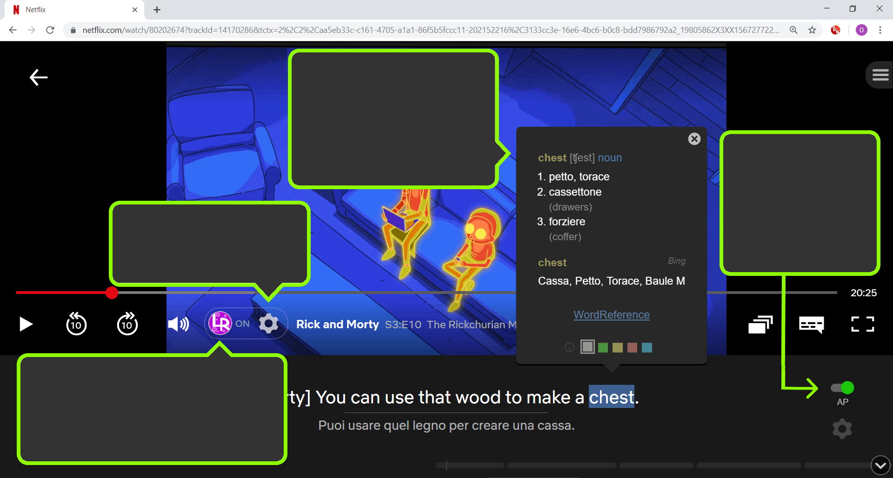
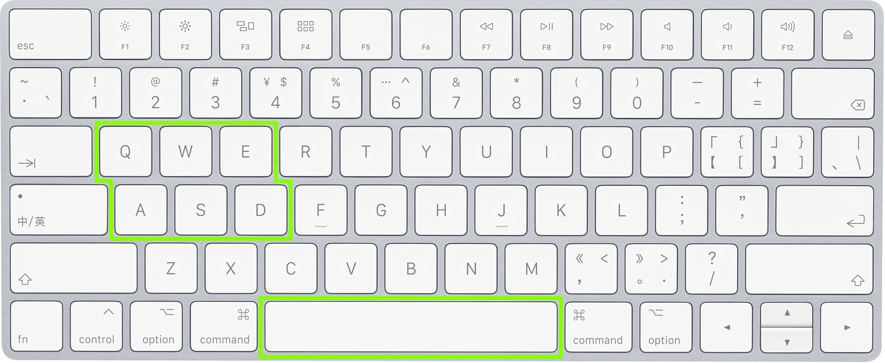
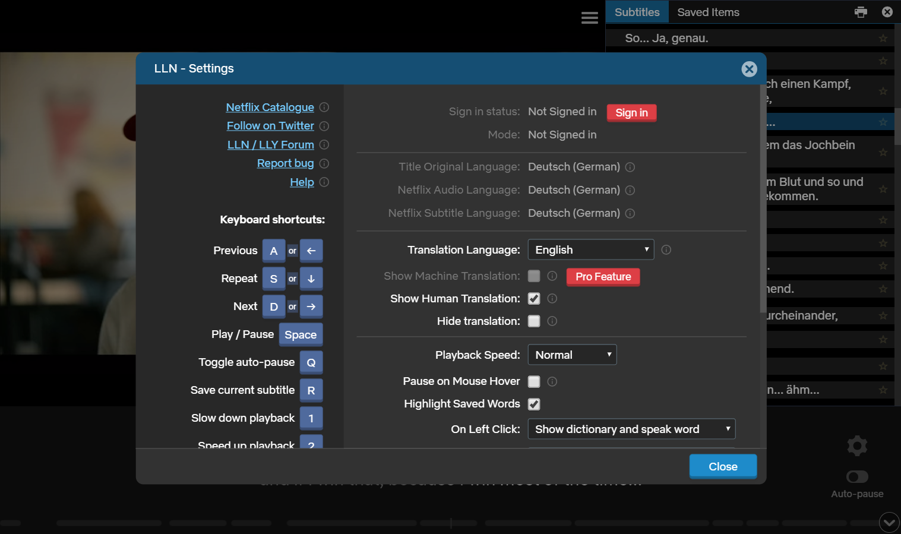
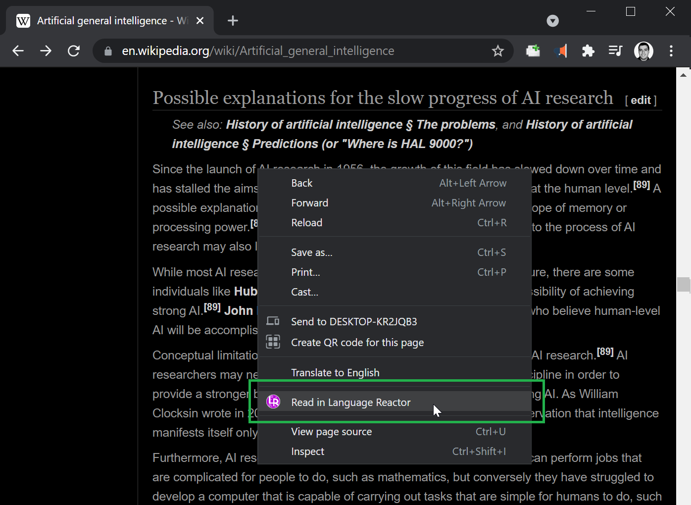

# [Language Reactor](https://www.languagereactor.com/)

语言反应器是一个强大的语言学习工具箱。 它可帮您发现、理解母语材料并从中学习。 学习将会更有效、更有趣、更快乐！ *(以前称为'通过Netflix学习语言')*

## 观看视频

安装浏览器扩展程序后，您在Netflix和YouTube网站观看视频时，将会享有语言学习的额外功能。

点击这里，以启用或禁用额外功能。

点击这里，以打开设置。

点击一个单词，查看词典。右击单词保存。

每段字幕后自动停止播放。

在设置中，您可以选择显示两种翻译，即机翻与人工翻译。机翻更侧重字面，如果您正在学习这种语言，这能帮助您理解其句型结构。当然，机翻有时存在错误。人工翻译通常很有帮助，因为能够准确翻译特定说法与习语。

您可以使用键盘按键控制播放。

- “a”键可回到之前的字幕。
- “s”键可重复该字幕。
- “d” 键可进入下一段字幕。
- 空格键可继续播放或暂停播放。

查看“设置”，了解更多快捷键用法。

## 观看内容

为帮您查找视频，我们为Netflix和YouTube创建了一个目录。您可在此页面左侧的菜单中打开目录。

YouTube的视频主题丰富，涉及所有主要语言。然而，YouTube会试图向您隐藏国外内容。

因此，我们在YouTube的搜索栏旁增加了这些按钮：

左侧的按钮会翻译搜索框中的文本，以便您更容易地找到所学语言的视频。右侧的按钮是用于搜索带有字幕的视频。

您可以将YouTube用户界面语言更改为您正在学习的语言。之后，YouTube就会向您展示更多该语言的视频。 [显示更多](https://www.languagereactor.com/youtube-language-help)

## 如何导入网页

您可以通过右击选单将网页导入Language Reactor。

您需要为此功能安装浏览器扩展。

