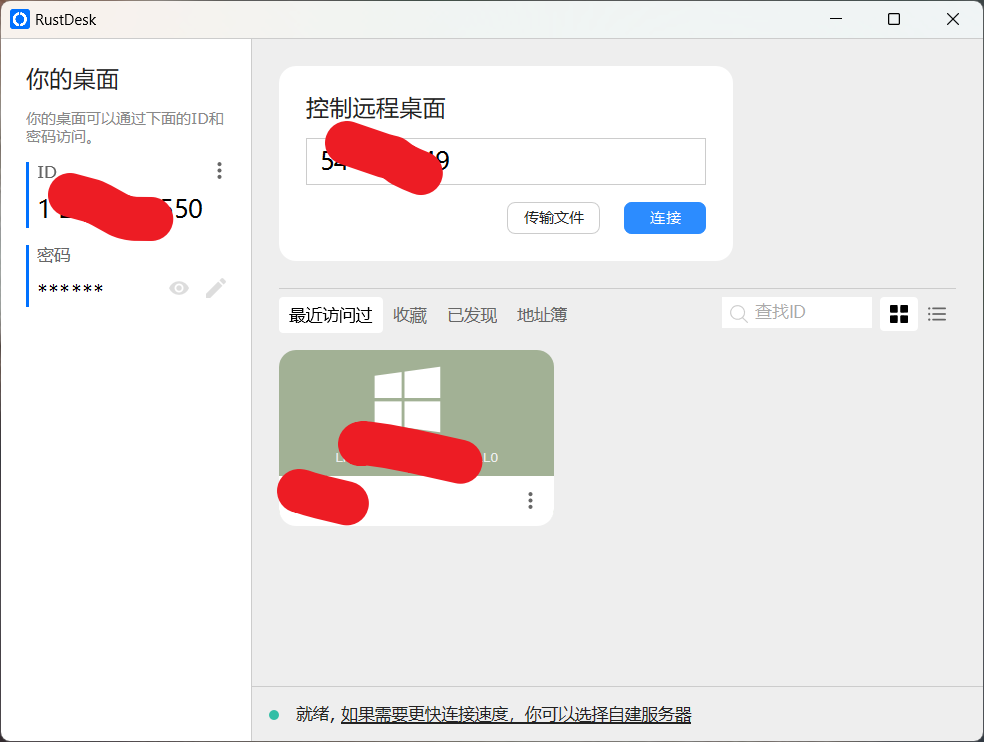

# [rustdesk](https://github.com/rustdesk/rustdesk) 简单易用的开源远程桌面工具

```
主要使用**Rust**语言开发，免费开源的远程桌面软件。

开箱即用无需任何配置，支持 Linux/Mac/Win/Android/IOS 等平台。

还能够自行搭建服务器。
```

若要实现远程桌面控制，控制端和被控端两者都必须安装rustDesk软件。

注意：**密码必须设置复杂一些**！！！

手机、ipda、电脑可以实现互联，公用服务器连接速度就完全ok，也可以自己搭建服务器。


