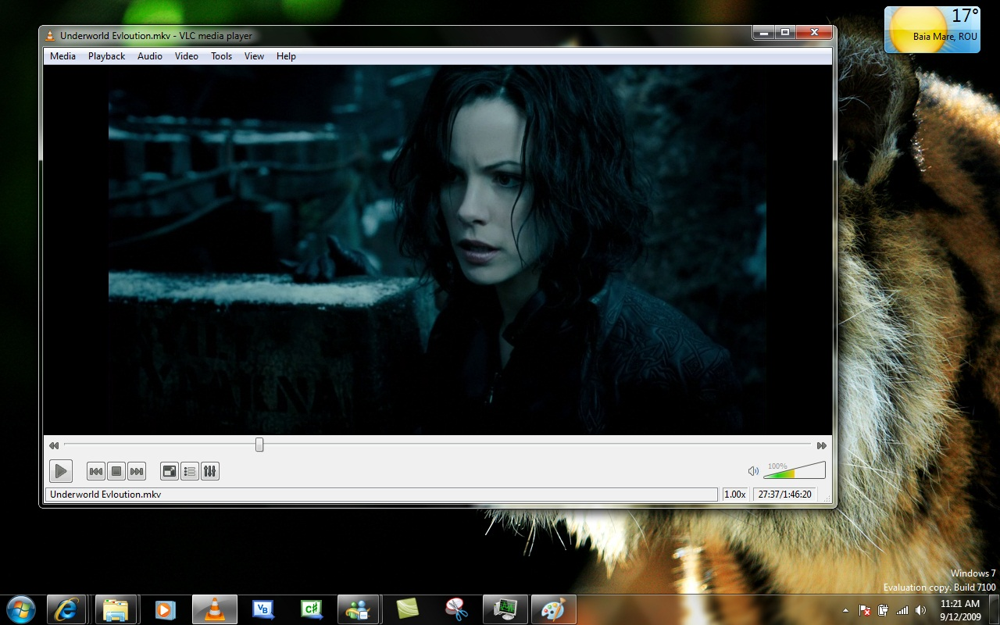

# [vlc](https://github.com/videolan/vlc) 强大的开源跨平台多媒体播放器及框架

http://www.videolan.org/vlc/

## 简单、快速、强大

-  **能播放任何内容** - 文件、光盘、摄像头、设备及流媒体
-  **可播放大多数格式，无需安装编解码器包** - MPEG-2, MPEG-4, H.264, MKV, WebM, WMV, MP3...
-  **可在所有平台运行** - Windows, Linux, Mac OS X, Unix, iOS, Android ...
-  **完全免费** - 无间谍软件，无广告，无跟踪用户的行为

## 自定义

-  [添加 **外观**.](http://www.videolan.org/vlc/skins.html)
-  [设计外观可采用 **VLC 外观编辑器**.](http://www.videolan.org/vlc/skineditor.html)
-  [安装 **扩展**.](https://addons.videolan.org/browse/cat/323/ord/latest/)